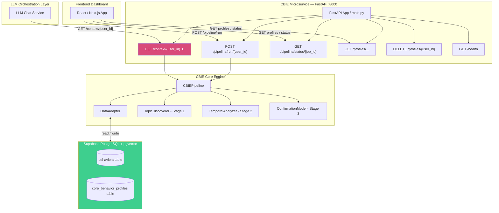

# Core Behaviour Identification Engine (CBIE) — System Documentation

> **Version:** 2.0  
> **Author:** DAYANANDA G.A.C.T  
> **Project:** Core Behaviour Analysis Component (CBAC) — Research Prototype  
> **Last Updated:** February 2026

---

## 1. Overview

The **Core Behaviour Identification Engine (CBIE)** is an offline, batch-processing analytical engine designed to analyze a user's entire interaction history and distill it into a stable **Core Behaviour Profile**. This profile serves as a persistent, high-fidelity identity anchor for Large Language Models (LLMs), enabling deep personalization across sessions.

The CBIE is exposed as a **FastAPI microservice**, allowing integration with LLM orchestration layers and frontend dashboards via a well-defined REST API.

### 1.1 The Problem

LLMs are stateless by nature. Every conversation starts from scratch, with no memory of who the user is, what they care about, or what they need. While a real-time **Behavior Analysis Component (BAC)** can log individual events and their dynamic scores, it produces raw, noisy data that fluctuates constantly. The CBIE solves this by acting as an offline "analyst" that processes the entire history of BAC logs to find **meaningful, long-term patterns**.

### 1.2 Key Distinction: BAC vs. CBIE

| Component | Role | Processing | Output |
|-----------|------|------------|--------|
| **BAC** | Real-time "sensor" | Logs individual events with dynamic scores (credibility, clarity, decay) | Raw behavioral event stream |
| **CBIE** | Offline "analyst" | Batch-processes the entire history to find stable patterns | Core Behaviour Profile (JSON) + Identity Anchor Prompt |

### 1.3 What the CBIE Produces

A single JSON document per user — the **Core Behaviour Profile** — containing:
- **Stable Facts**: Permanent identity constraints (e.g., allergies, dietary restrictions)
- **Stable Interests**: Confirmed, long-term behavioral patterns (e.g., "interested in machine learning")
- **Emerging Interests**: Growing but not yet confirmed patterns (e.g., "recently exploring photography")
- **ARCHIVED_CORE**: Historical habits that have faded but are kept on record
- **Noise**: Discarded one-off queries that don't represent real interests

And a compiled **Identity Anchor Prompt** — a plain-English system message ready to be injected into an LLM call.

---

## 2. System Architecture



### 2.1 Component Overview

| File | Class | Stage | Responsibility |
|------|-------|-------|----------------|
| `data_adapter.py` | `DataAdapter` | Ingestion / Output | Reads `behaviors` table from Supabase, writes profile to `core_behavior_profiles` |
| `topic_discovery.py` | `TopicDiscoverer` | Stage 1 | Fact isolation (Zero-Shot NLP), Azure embeddings, DBSCAN clustering, LLM topic labeling |
| `temporal_analysis.py` | `TemporalAnalyzer` | Stage 2 | Gini Coefficient (consistency), Mann-Kendall Trend Test (momentum) |
| `confirmation_model.py` | `ConfirmationModel` | Stage 3 | AHP-weighted heuristic scoring, Vitality Pruning, status classification |
| `pipeline.py` | `CBIEPipeline` | Orchestration | Ties all stages together; generates the Identity Anchor Prompt string |
| `api/main.py` | FastAPI app | API Layer | App entry point, CORS, lifespan startup, health endpoints |
| `api/dependencies.py` | — | API Layer | Pipeline singleton (load-once), in-memory job store for background runs |
| `api/models.py` | Pydantic models | API Layer | All request/response schemas |
| `api/routers/context.py` | — | API Layer | `GET /context/{user_id}` — the critical LLM endpoint |
| `api/routers/pipeline_router.py` | — | API Layer | `POST /pipeline/run`, `GET /pipeline/status` |
| `api/routers/profiles.py` | — | API Layer | Profile CRUD and inspection endpoints |
| `generate_test_data.py` | — | Testing | Generates multi-user test data with Azure embeddings, seeds to Supabase |

---

## 3. Data Pipeline

### 3.1 Input Schema (Supabase `behaviors` table)

Each row represents a single behavioral event logged by the BAC. The CBIE **only reads rows where `behavior_state = 'ACTIVE'`**, respecting the BAC's conflict resolution so that SUPERSEDED and FLAGGED behaviors are never analyzed.

| Column | Type | Description |
|--------|------|-------------|
| `behavior_id` | `TEXT (PK)` | Unique identifier |
| `user_id` | `TEXT` | The owning user |
| `behavior_text` | `TEXT` | Raw natural language text of the behavior |
| `embedding` | `vector(3072)` | Pre-computed semantic embedding (Azure `text-embedding-3-large`) |
| `credibility` | `REAL` | BAC-assigned credibility (0.0 – 1.0) |
| `clarity_score` | `REAL` | Clarity of expression (0.0 – 1.0) |
| `extraction_confidence` | `REAL` | BAC extraction confidence (0.0 – 1.0) |
| `intent` | `TEXT` | `PREFERENCE`, `CONSTRAINT`, `HABIT`, `SKILL`, `QUERY`, `COMMUNICATION` |
| `target` | `TEXT` | Subject/object of the behavior |
| `context` | `TEXT` | Domain (e.g., `tech`, `health`, `food`) |
| `polarity` | `TEXT` | `POSITIVE` or `NEGATIVE` |
| `created_at` | `TIMESTAMPTZ` | When first recorded |
| `decay_rate` | `REAL` | Rate of relevance decay (0.0 for facts) |
| `reinforcement_count` | `INTEGER` | Number of times expressed |
| `behavior_state` | `TEXT` | `ACTIVE` \| `SUPERSEDED` \| `FLAGGED` \| `DECAYED` |

### 3.2 Output Schema (Supabase `core_behavior_profiles` table)

| Column | Type | Description |
|--------|------|-------------|
| `id` | `SERIAL (PK)` | Auto-incrementing PK |
| `user_id` | `TEXT (UNIQUE)` | The owning user |
| `total_raw_behaviors` | `INTEGER` | Number of input behaviors processed |
| `confirmed_interests` | `JSONB` | Array of confirmed interest cluster objects |
| `identity_anchor_prompt` | `TEXT` | Pre-compiled system prompt for LLMs |
| `created_at` | `TIMESTAMPTZ` | Profile creation timestamp |
| `updated_at` | `TIMESTAMPTZ` | Last regeneration timestamp |

Each object in the `confirmed_interests` JSONB array:

```json
{
    "cluster_id": "absolute_fact" | 0 | 1 | 2,
    "representative_topics": ["Python Backend Development"],
    "frequency": 7,
    "consistency_score": 0.12,
    "trend_score": 0.0,
    "core_score": 0.85,
    "status": "Stable" | "Emerging" | "Stable Fact" | "ARCHIVED_CORE" | "Noise"
}
```

---

## 4. Technical Methodology

### 4.1 Stage 1: Topic Discovery & Fact Isolation (`TopicDiscoverer`)

#### 4.1.1 Absolute Fact Isolation (Zero-Shot NLP Detection)

Before clustering, every behavior's raw text is passed through a **multi-layer fact detection pipeline** to identify permanent identity constraints (allergies, dietary restrictions, medical conditions).

> **Key Design Decision:** The CBIE does NOT use the BAC's `intent` field as the sole signal, nor does it use brittle hardcoded keyword arrays. It uses a **Zero-Shot NLP Classifier** (`facebook/bart-large-mnli`) to dynamically evaluate semantic meaning.

**Two-Layer Detection Strategy:**

| Layer | Signal | Weight |
|-------|--------|--------|
| **Zero-Shot NLP** (Primary) | Scores text against `"medical condition or allergy"`, `"strict dietary restriction"`, `"permanent identity trait"` using `multi_label=True` | Max score across all three labels |
| **BAC Metadata** (Secondary Boost) | If `intent == CONSTRAINT`: +0.10. If `polarity == NEGATIVE` AND `intent == CONSTRAINT`: additional +0.05 | Additive boost only |

**Decision Rule:** If combined `fact_confidence ≥ 0.60` → classified as **Absolute Fact**.

**Example detection trace:**
```
Input: "I am severely allergic to penicillin"
  Zero-Shot "medical condition or allergy" → 0.92
  BAC intent = CONSTRAINT                  → +0.10
  BAC polarity = NEGATIVE                  → +0.05
  ─────────────────────────────────────────────────
  Total fact_confidence = 1.07  (≥ 0.60) → FACT ✓
```

Facts are immediately routed to the profile with `core_score = 1.0` and `status = "Stable Fact"`. No temporal analysis is needed.

#### 4.1.2 Semantic Embeddings (Azure OpenAI `text-embedding-3-large`)

All remaining (non-fact) behaviors are embedded using Azure OpenAI's `text-embedding-3-large` model, producing **3072-dimensional** semantic vectors. If the database already contains precomputed embeddings, they are reused. Missing embeddings are generated in batches of 20.

- **Model:** `text-embedding-3-large`
- **Dimensions:** 3072
- **Storage:** pgvector `vector(3072)` column in Supabase

#### 4.1.3 Entity Extraction (spaCy + EntityRuler)

Each behavior's text is processed through spaCy's NER pipeline (`en_core_web_sm`), extended with a custom **EntityRuler** for domain-specific terms (e.g., `kubernetes` → `TECH`, `hdbscan` → `ALGO`).

#### 4.1.4 Polarity-Aware DBSCAN Clustering

Dense semantic embeddings are clustered using **DBSCAN** with a customized precomputed distance matrix:

1. **Base Matrix:** Pairwise Euclidean distances computed via `sklearn.metrics.pairwise.euclidean_distances`.
2. **Polarity Penalty:** If two behaviors have opposite sentiments (`POSITIVE` vs `NEGATIVE`), their distance is artificially set to `1000.0` (effectively infinity), mathematically preventing them from clustering together.
3. **DBSCAN Parameters:** `eps=1.1`, `min_samples=3`, `metric='precomputed'`.

> **Why DBSCAN over HDBSCAN?** At 3072 dimensions, HDBSCAN suffers from the "curse of dimensionality" and struggles to identify density valleys without UMAP reduction. Standard DBSCAN with a tightly tuned `eps=1.1` performs flawlessly for semantic segmentation across high-dimensional Azure embeddings.

Behaviors assigned `cluster_id = -1` are classified as **noise** and excluded from the profile.

#### 4.1.5 Generative Topic Labeling (Azure OpenAI `gpt-4o-mini`)

After clustering, the raw behavior texts of each cluster are passed to `gpt-4o-mini` with a structured prompt asking for a single cohesive trait label (max 4-5 words). This replaces raw query strings like `"Creating a custom middleware in FastAPI"` with high-level traits like `"Python Backend Development"`.

The same generalization pipeline applies to Absolute Facts for consistent identity anchoring.

---

### 4.2 Stage 2: Temporal Analysis (`TemporalAnalyzer`)

#### 4.2.1 Consistency — Gini Coefficient

Measures the uniformity of time intervals between behaviors in a cluster.

**How it works:**
1. Sort all cluster timestamps chronologically
2. Compute inter-event time gaps (in days)
3. Apply the Gini Coefficient formula

**Interpretation:**

| Gini | Meaning |
|------|---------|
| `0.0` | Perfectly consistent (equal intervals) |
| `0.3` | Fairly consistent |
| `0.8+` | Burst activity, then long silence |
| `1.0` | Single data point — cannot determine |

**Formula:**

$$G = \frac{\sum_{i=1}^{n}(2i - n - 1) \cdot x_i}{n \cdot \sum_{i=1}^{n} x_i}$$

Where $x_i$ are the **sorted** inter-event times and $n$ is the number of intervals.

> The Gini score is **inverted** in Stage 3: lower Gini (more consistent) → higher contribution to the final score.

#### 4.2.2 Trend — Mann-Kendall Test

A non-parametric statistical test applied to the sequence of `complexity_score` values within a cluster over time to detect monotonic trends.

| Result | Trend Score | Meaning |
|--------|-------------|---------|
| `increasing` | `1.0` | Deepening engagement |
| `decreasing` | `-1.0` | Fading interest |
| `no trend` | `0.0` | No significant change |

Requires ≥ 4 data points; otherwise defaults to `0.0`.

---

### 4.3 Stage 3: Confirmation Model (`ConfirmationModel`)

#### 4.3.1 AHP-Weighted Heuristic Score

Combines all signals into a final `core_score` using AHP-derived weights:

| Factor | Weight | Source | Normalization |
|--------|--------|--------|---------------|
| **Consistency** | `0.35` | Gini (Stage 2) | `1.0 - Gini` (inverted) |
| **Credibility** | `0.30` | Avg BAC credibility across cluster | Already 0.0 – 1.0 |
| **Frequency** | `0.25` | Cluster size / max cluster size | Relative 0.0 – 1.0 |
| **Trend** | `0.10` | Mann-Kendall result (Stage 2) | `(score + 1.0) / 2.0` |

**Formula:**

$$\text{CoreScore} = (0.35 \times (1 - G)) + (0.30 \times C) + \left(0.25 \times \frac{f}{f_{max}}\right) + \left(0.10 \times \frac{T + 1}{2}\right)$$

Where: $G$ = Gini, $C$ = avg credibility, $f$ = cluster frequency, $f_{max}$ = largest cluster size, $T$ = trend score.

> Weights derived via **Analytic Hierarchy Process (AHP)**. Consistency is weighted highest as repeated engagement is the strongest signal of a core long-term behavior.

#### 4.3.2 Status Classification (Vitality Pruning)

| Core Score | Status | LLM Treatment |
|------------|--------|---------------|
| `≥ 0.70` | **Stable** | Included in active context window |
| `0.40 – 0.69` | **Emerging** | Included in active context window with caveat |
| `0.15 – 0.39` | **Noise** | Excluded from profile entirely |
| `< 0.15` | **ARCHIVED_CORE** | Kept in DB for historical record but excluded from LLM prompt |
| _(any, if fact)_ | **Stable Fact** | Permanently injected into `CRITICAL CONSTRAINTS` section |

---

## 5. Pipeline Execution Flow

```
Step 1: INGESTION
  └─ DataAdapter → Supabase
  └─ SELECT * FROM behaviors WHERE user_id = ? AND behavior_state = 'ACTIVE'
  └─ Parses embeddings (string → numpy), credibility, timestamps, polarity
  └─ Returns time-sorted list of behavior dicts

Step 2: TOPIC DISCOVERY (Stage 1)
  ├─ Zero-Shot NLP Classification → Isolate Absolute Facts
  │     └─ Facts bypass all scoring → core_score = 1.0, status = "Stable Fact"
  └─ Standard Behaviors:
        ├─ spaCy NER + EntityRuler → extracted entities
        ├─ Use precomputed embeddings (or generate via Azure if missing)
        ├─ Build Euclidean distance matrix
        ├─ Apply Polarity Penalty (POSITIVE vs NEGATIVE → distance = 1000)
        ├─ DBSCAN(eps=1.1, min_samples=3) → cluster_id per behavior
        └─ gpt-4o-mini → cohesive 4-5 word topic label per cluster

Step 3: TEMPORAL ANALYSIS (Stage 2) — per cluster
  ├─ Compute inter-event time gaps from timestamps
  ├─ Gini Coefficient → consistency_score
  └─ Mann-Kendall Test on scores → trend_score

Step 4: CONFIRMATION (Stage 3) — per cluster
  ├─ Average BAC credibility across cluster
  ├─ AHP core_score = (0.35 × consistency) + (0.30 × credibility) +
  │                   (0.25 × frequency) + (0.10 × trend)
  └─ Vitality Pruning → Stable | Emerging | Noise | ARCHIVED_CORE

Step 5: PROMPT GENERATION
  ├─ generate_identity_prompt() compiles interests by status into a human-readable
  │   system message string (Critical Constraints, Stable, Emerging, Archived)
  └─ identity_anchor_prompt stored in profile JSON and Supabase

Step 6: OUTPUT
  ├─ Save Core Behaviour Profile JSON → data/profiles/<user_id>_profile.json
  ├─ Save Identity Anchor text → data/profiles/<user_id>_prompt.txt
  └─ UPSERT into Supabase core_behavior_profiles (on_conflict: user_id)
```

---

## 6. REST API Reference (FastAPI Microservice)

The CBIE is deployed as a FastAPI microservice. All endpoints are documented interactively at **`http://localhost:8000/docs`** (Swagger UI).

### 6.1 LLM Context Endpoint ⭐

This is the single most critical integration point — the LLM's chat service calls this before every AI response to retrieve the user's identity anchor.

#### `GET /context/{user_id}`

Reads the pre-built Identity Anchor Prompt from `core_behavior_profiles`. **No pipeline re-run is triggered** — designed for near-instant latency.

**Response** `200 OK`:
```json
{
    "user_id": "user_alpha_01",
    "identity_anchor_prompt": "--- SYSTEM IDENTITY ANCHOR FOR USER: user_alpha_01 ---\n...",
    "profile_exists": true,
    "total_raw_behaviors": 105,
    "last_updated": "2026-02-27T04:15:00Z"
}
```
Returns `404` if no profile exists; returns `503` if the database is unavailable.

---

### 6.2 Pipeline Endpoints

Because the CBIE pipeline can take **several minutes** (Zero-Shot NLP model is CPU-bound), all runs are **asynchronous background jobs**.

#### `POST /pipeline/run/{user_id}` — `202 Accepted`

Queues a full CBIE analysis for a user and returns immediately with a `job_id`.

**Response:**
```json
{
    "job_id": "a1b2c3d4-...",
    "status": "QUEUED",
    "user_id": "user_spartan_02",
    "message": "Pipeline run queued. Poll GET /pipeline/status/a1b2c3d4-..."
}
```

#### `GET /pipeline/status/{job_id}`

Polls the status of a queued pipeline run.

**Response:**
```json
{
    "job_id": "a1b2c3d4-...",
    "user_id": "user_spartan_02",
    "status": "COMPLETED",
    "started_at": "2026-02-27T04:10:00Z",
    "completed_at": "2026-02-27T04:14:32Z",
    "result": { "user_id": "...", "confirmed_interests": [...] },
    "error": null
}
```
| Status | Meaning |
|--------|---------|
| `QUEUED` | Job accepted, not yet started |
| `RUNNING` | Pipeline actively processing |
| `COMPLETED` | Profile saved; `result` contains the full profile JSON |
| `FAILED` | Error occurred; see `error` field |

---

### 6.3 Profile Endpoints (Frontend Dashboard)

| Method | Path | Description |
|--------|------|-------------|
| `GET` | `/profiles/` | Paginated list of all users with profiles (`?limit=50&offset=0`) |
| `GET` | `/profiles/{user_id}` | Full Core Behaviour Profile JSON for a user |
| `GET` | `/profiles/{user_id}/interests` | Only the `confirmed_interests` array (supports `?status_filter=Stable`) |
| `GET` | `/profiles/{user_id}/facts` | Only interests with `status = "Stable Fact"` (for constraint alert panels) |
| `DELETE` | `/profiles/{user_id}` | Delete profile from Supabase and local JSON file (`204 No Content`) |

**`GET /profiles/` — Response:**
```json
{
    "total": 3,
    "profiles": [
        {
            "user_id": "user_alpha_01",
            "total_raw_behaviors": 105,
            "interest_count": 14,
            "fact_count": 5,
            "stable_count": 6,
            "emerging_count": 3,
            "last_updated": "2026-02-27T04:15:00Z"
        }
    ]
}
```

---

### 6.4 Health & Service Info

| Method | Path | Description |
|--------|------|-------------|
| `GET` | `/health` | Returns `{"status": "ok", "pipeline_ready": true/false}` |
| `GET` | `/` | Returns service name, version, and doc links |

---

### 6.5 API Design Decisions

| Decision | Rationale |
|----------|-----------|
| **Pipeline Singleton** | The BART zero-shot model (~1.5 GB) is loaded **once** at app startup via a `lifespan` context manager. All requests share the same instance to avoid re-loading on every call. |
| **Background Tasks** | `FastAPI.BackgroundTasks` runs the CPU-bound pipeline in a thread-pool executor (`loop.run_in_executor`), freeing the async event loop for other requests. |
| **In-Memory Job Store** | Sufficient for a research prototype. Easily replaceable with Redis/Celery in production. |
| **CORS: allow all** | Frontend domain not yet finalized — tighten once the frontend URL is known. |
| **`/context` reads DB only** | The LLM endpoint does NOT re-run the pipeline; it reads cached data for millisecond latency. The pipeline must be explicitly triggered via `POST /pipeline/run`. |

---

## 7. Example Output

For `user_alpha_01` (105 behaviors across varied domains):

**Identity Anchor Prompt (injected into LLM system message):**
```text
--- SYSTEM IDENTITY ANCHOR FOR USER: user_alpha_01 ---
You are speaking with a user who has following core traits and constraints.

CRITICAL CONSTRAINTS (Never violate):
- Penicillin Allergy Constraint
- Strict Vegan Diet
- Asthma Management
- Weekend Work Restriction
- Celiac Disease (No Gluten)

VERIFIED STABLE PREFERENCES:
- React Frontend Development
- Python Backend Development (FastAPI)
- Espresso Preparation and Techniques
- Django Framework Criticisms

EMERGING INTERESTS (Needs more verification):
- Science Fiction Literature
- Personal Finance Optimization
```

**Edge-case validation results:**

| User | Behaviors | Result |
|------|-----------|--------|
| `user_spartan_02` | 12 (focused) | 1 Stable interest: `Barefoot Running Techniques` |
| `user_chaos_03` | 149 (120 pure noise) | 120 noise vectors discarded; 2 constraints + 3 emerging found correctly |

---

## 8. Technology Stack

| Technology | Version | Purpose |
|-----------|---------|---------|
| Python | 3.10+ | Core language |
| `fastapi` | ≥ 0.111.0 | REST API framework |
| `uvicorn` | ≥ 0.29.0 | ASGI server |
| `pydantic` | ≥ 2.6.0 | Request/response schema validation |
| `openai` | ≥ 1.0.0 | Azure embeddings (`text-embedding-3-large`) and LLM topic labeling (`gpt-4o-mini`) |
| `transformers` | ≥ 4.35.0 | Zero-Shot classifier (`facebook/bart-large-mnli`) |
| `torch` | ≥ 2.1.0 | PyTorch backend for Transformers |
| `spacy` | ≥ 3.7.2 | NER + EntityRuler domain adaptation |
| `scikit-learn` | ≥ 1.3.0 | DBSCAN clustering, Euclidean distance matrices |
| `pymannkendall` | ≥ 1.4.3 | Mann-Kendall Trend Test |
| `scipy` | ≥ 1.11.4 | Statistical utilities |
| `numpy` / `pandas` | ≥ 1.26 / ≥ 2.1 | Numerical / tabular data handling |
| `supabase` | ≥ 2.3.4 | Cloud DB client (PostgreSQL + pgvector) |
| `python-dotenv` | ≥ 1.0.0 | Environment variable management |

---

## 9. Project Structure

```
cbie_engine/
│
├── .env                              # API keys (SUPABASE_URL, SUPABASE_KEY, OPENAI_API_KEY, etc.)
├── requirements.txt                  # All Python dependencies
├── setup_supabase.sql                # SQL schema: behaviors (vector(3072)) + core_behavior_profiles
│
│── pipeline.py                       # CBIEPipeline orchestrator + Identity Anchor Prompt generator
├── data_adapter.py                   # Supabase read (behaviors) / write (core_behavior_profiles)
├── topic_discovery.py                # Stage 1: Zero-Shot NLP, Azure embeddings, DBSCAN, gpt-4o-mini labels
├── temporal_analysis.py              # Stage 2: Gini Coefficient + Mann-Kendall Test
├── confirmation_model.py             # Stage 3: AHP scoring + Vitality Pruning
│
├── api/                              # FastAPI Microservice Package
│   ├── __init__.py
│   ├── main.py                       # App entry point, CORS, lifespan, /health, / endpoints
│   ├── models.py                     # All Pydantic request/response schemas
│   ├── dependencies.py               # Pipeline singleton + in-memory job store
│   └── routers/
│       ├── __init__.py
│       ├── context.py                # GET /context/{user_id}
│       ├── pipeline_router.py        # POST /pipeline/run, GET /pipeline/status
│       └── profiles.py               # GET/DELETE /profiles/...
│
├── generate_test_data.py             # Multi-user test data generator (Azure embeddings → Supabase)
├── test_models.py                    # Unit tests for Gini, Mann-Kendall, AHP scoring
├── verify_db.py                      # Quick Supabase DB verification script
│
└── data/
    └── profiles/                     # Local profile outputs
        ├── user_alpha_01_profile.json
        ├── user_alpha_01_prompt.txt
        ├── user_spartan_02_profile.json
        ├── user_spartan_02_prompt.txt
        ├── user_chaos_03_profile.json
        └── user_chaos_03_prompt.txt
```

---

## 10. Environment Variables (`.env`)

```env
# Supabase
SUPABASE_URL=https://<project-ref>.supabase.co
SUPABASE_KEY=<anon-or-service-role-key>

# Azure OpenAI
OPENAI_API_KEY=<azure-api-key>
OPENAI_API_VERSION=2024-02-01
OPENAI_API_BASE=https://<resource-name>.openai.azure.com/
OPENAI_EMBEDDING_MODEL=text-embedding-3-large
```

---

## 11. How to Run

### Prerequisites
```bash
python -m venv venv
.\venv\Scripts\Activate.ps1       # Windows PowerShell

pip install -r requirements.txt
python -m spacy download en_core_web_sm
```

### Setup Database
1. Open the **Supabase SQL Editor** and run `setup_supabase.sql`
2. Populate `.env` with your Supabase and Azure OpenAI credentials

### Generate Test Data
```bash
python generate_test_data.py
```
Creates 3 simulated users (`user_alpha_01`, `user_spartan_02`, `user_chaos_03`) with Azure embeddings seeded into Supabase.

### Run the Pipeline Directly (CLI)
```bash
python pipeline.py --user_id user_alpha_01
python pipeline.py --user_id user_spartan_02
python pipeline.py --user_id user_chaos_03
```

### Start the API Server
```bash
uvicorn api.main:app --host 0.0.0.0 --port 8000 --reload
```
- **Swagger UI:** `http://localhost:8000/docs`
- **ReDoc:** `http://localhost:8000/redoc`
- **Health Check:** `http://localhost:8000/health`

### Trigger a Pipeline Run via API
```bash
# 1. Trigger the run (returns job_id immediately)
curl -X POST http://localhost:8000/pipeline/run/user_alpha_01

# 2. Poll for completion
curl http://localhost:8000/pipeline/status/<job_id>

# 3. Get the LLM context prompt
curl http://localhost:8000/context/user_alpha_01
```

### Run Unit Tests
```bash
python -m pytest test_models.py -v
```

---

## 12. Design Decisions & Research Justification

| Decision | Justification |
|----------|---------------|
| **DBSCAN over HDBSCAN** | At 3072 dimensions, HDBSCAN struggles to identify density valleys. DBSCAN with `eps=1.1` provides mathematically clean semantic separation. |
| **Azure `text-embedding-3-large`** | Provides 3072-dimension high-quality semantic vectors, outperforming local 384-dimension models for contextual nuance. |
| **Generative LLM Labeling** | `gpt-4o-mini` summarises cluster texts into human-readable traits, replacing raw query strings in the identity anchor prompt. |
| **Gini Coefficient** | Non-parametric, robust to outliers, intuitively measures evenness of interaction frequency. |
| **Mann-Kendall Test** | Non-parametric trend test requiring no normal distribution assumption. |
| **AHP Weight Derivation** | Formal multi-criteria framework providing transparent, justifiable, and reproducible weights. |
| **Zero-Shot NLP Fact Detection** | Eliminates brittle keyword lists; understands synonyms and context dynamically. Acts as an independent safety net for critical health info. |
| **Fact Bypass (score = 1.0)** | Safety-critical constraints (allergies) must never be lost to decay or low frequency. |
| **ACTIVE-only ingestion** | Respects the BAC's behavioral lifecycle — SUPERSEDED behaviors represent changed habits and should not contaminate the current profile. |
| **Polarity-Aware Clustering** | Artificial infinity penalties in the distance matrix mathematically guarantee opposing sentiments cluster into separate identity traits. |
| **Vitality Pruning (ARCHIVED_CORE)** | Cleans the LLM context window by fading inactive historical habits while preserving the historical record in the database. |
| **Identity Anchor Prompt format** | Distills complex mathematical profiles into a plain-English string an LLM can universally understand without structured data parsing. |
| **Microservice API (FastAPI)** | Decouples the CBIE from other system components; allows LLM services and frontend to query independently via REST. |
| **Pipeline Singleton at startup** | Loads the BART model once — prevents re-initialising 1.5 GB on every API request and ensures sub-second response on the LLM context endpoint. |
| **Async background jobs** | Pipeline runs are CPU/IO-bound; `run_in_executor` prevents blocking the FastAPI async event loop for other concurrent requests. |
| **Offline batch processing** | Enables comprehensive full-history analysis without real-time latency constraints; designed as a scheduled job, not a request-response system. |
| **Supabase (PostgreSQL + pgvector)** | Production-grade vector storage with native similarity search; enables future cosine-similarity queries on stored embeddings. |
